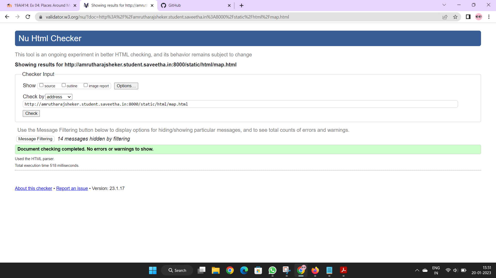

# Places Around Me
## AIM:
To develop a website to display details about the places around my house.

## Design Steps:

### Step 1:
Clone the github repository into thea IDE.

### Step 2:
Create a new Django project

### Step 3:
Write the needed HTML code

### Step 4:
Run the Django server and execute the HTML files.

## Code:
```
map.html

<!DOCTYPE html>
<html lang="en">
<head>
<title>My City</title>
</head>
<body>
<h1 align="center">
<font color="red"><b>THIRUVANMIYUR</b></font>
</h1>
<h3 align="center">
<font color="blue"><b>AMRUTHA RAJSHEKER (22004501)</b></font>
</h3>
<center>

<map name="MyCity">
<area shape="circle" coords="190,50,20" href="/static/html/cinemas.html" title="S2 CINEMAS">
<area shape="rectangle" coords="230,30,260,60" href="/static/html/bank.html" title="SBI bank">
<area shape="circle" coords="400,350,50" href="/static/html/shop.html" title="Cotton house">
<area shape="circle" coords="400,200,75" href="/static/html/bus.html" title="Thiruvanmiyur  bus terminal">
<area shape="rectangle" coords="490,150,870,320" href="/static/html/arts.html" title="Kalakshetra foundation">
</map>
</center>
</body>
</html>


cinemas.html

<!DOCTYPE html>
<html lang="en">
<head>
<title>THEATER </title>
</head>
<body bgcolor="cyan">
<h1 align="center">
<font color="red"><b>THIRUVANMIYUR</b></font>
</h1>
<h3 align="center">
<font color="blue"><b>S2 CINEMAS</b></font>
</h3>
<hr size="3" color="red">
<p align="justify">
<font face="Courier New" size="5">
<b>
SPI S2 Cinemas, Theyagaraja 
Watching a movie is no longer limited to a weekend, it has become an everyday affair thanks to movie theatres with world-class facilities. SPI S2 Cinemas, Theyagaraja is a chain of theatres in India that exhibit a myriad of movies around the year. Be it a Regional, Bollywood or Hollywood movie, at SPI S2 Cinemas, Theyagaraja you can catch them all.
Movie buffs, rejoice now as there's no need to worry for last moment movie ticket booking! Book tickets online for SPI S2 Cinemas, Theyagaraja at Paytm and get ready for an entertainment-packed time with your friends and family! Enjoy newly released movies in Chennai through this seamless movie ticket booking website.</b>
</font>
</p>
</body>
</html>


bank.html

<!DOCTYPE html>
<html lang="en">
<head>
<title>BANK</title>
</head>
<body bgcolor="yellow">
<h1 align="center">
<font color="red"><b>THIRUVANMIYUR</b></font>
</h1>
<h3 align="center">
<font color="blue"><b>SBI BANK</b></font>
</h3>
<hr size="3" color="red">
<p align="justify">
<font face="Tahoma" size="5">
State Bank Of India in Thiruvanmiyur, Chennai The leading public sector bank, State Bank of India in Thiruvanmiyur, Chennai is one among the network of branches all over the city. Commonly referred to as SBI, this financial institution is the India's largest bank and a Fortune 500 company that came into existence in the year 1955. Headquartered in Mumbai, this government owned corporation is a leading entity in the banking and financial services sector. This bank provides financial services and products to individuals, micro, small and medium enterprises, large and mid-sized corporate, and several agricultural, rural, and retail businesses. This bank takes pride in its widespread presence that covers over 24,000 branches and 59,000 ATMs. Since 1973, it is actively involved in non-profit activity called community service banking. SBI has received countless awards and accolades for its conscientious efforts in always putting the customer first. Among the numerous branches spread out in Chennai is the branch in Thiruvanmiyur. Locate it with ease at No 55 D on the Lattice Bridge Road. Contact this bank branch on any of the following contact numbers: +(91)-44-24525505,24521696.
</font>
</p>
</body>
</html>


shop.html

<!DOCTYPE html>
<html lang="en">
<head>
<title>SHOPPING COMPLEX</title>
</head>
<body bgcolor="pink">
<h1 align="center">
<font color="red"><b>THIRUVANMIYUR</b></font>
</h1>
<h3 align="center">
<font color="blue"><b>COTTON HOUSE</b></font>
</h3>
<hr size="3" color="red">
<p align="justify">
<font face="Arial" size="5">
<b>
Cotton House in Thiruvanmiyur, Chennai is known to satisfactorily cater to the demands of its customer base. The business came into existence in 1998 and has, since then, been a known name in its field. It stands located at Old No 68, Near Thiruvanmiyur Signal, L B Road, Thiruvanmiyur-600041. Near Thiruvanmiyur Signal is a prominent landmark in the area and this establishment is in close proximity to the same. It has earned 3200 reviews and aspires to develop a loyal customer base. It has earned stamps like Jd Verified, Jd Trusted, Jd Escrow substantiating the credentials of the business.The business strives to make for a positive experience through its offerings. The accepted modes of payment such as Cash, Debit Cards, Credit Card make every business transaction easy and seamless, contributing to making the entire process even more effective.
</b>
</font>
</p>
</body>
</html>


ghs.html

<!DOCTYPE html>
<html lang="en">
<head>
<title>Govt. High. Sec. School</title>
</head>
<body bgcolor="lime">
<h1 align="center">
<font color="red"><b>Ariyalur - Cement City</b></font>
</h1>
<h3 align="center">
<font color="blue"><b>Government Higher Secondary School</b></font>
</h3>
<hr size="3" color="red">
<p align="justify">
<font face="Georgia" size="5">
The main objectives of Ariyalur Government Higher Secondary School are 
<ul>
<li>To impart proper and qualified training to teachers and give them an attractive salary and incentives so that they are not tempted to quit and look elsewhere for jobs.</li>
<li>To provide financial aids and grants wisely and judiciously.</li>
<li>To Frame of syllabus and curriculum.</li>
<li>To set aims and objectives of education.</li>
</ul>
</font>
</p>
</body>
</html>


vk.html

<!DOCTYPE html>
<html lang="en">
<head>
<title>Washerman’s Lake</title>
</head>
<body bgcolor="orange">
<h1 align="center">
<font color="red"><b>Ariyalur - Cement City</b></font>
</h1>
<h3 align="center">
<font color="blue"><b>Washerman's Lake</b></font>
</h3>
<hr size="3" color="red">
<p align="justify">
<font face="Georgia" size="5">
The uses of Washerman's Lake in Ariyalur District are 
<ol type="1">
<li>Lake is used for rain water harvesting.</li>
<li>It is used for drinking.</li>
<li>Pisculture.</li>
<li>For bathing, washing clothes etc.</li>
</ol>
</font>
</p>
</body>
</html>
```

## Output:


## HTML Validator


## Result:
The program for implementing image map is executed successfully.